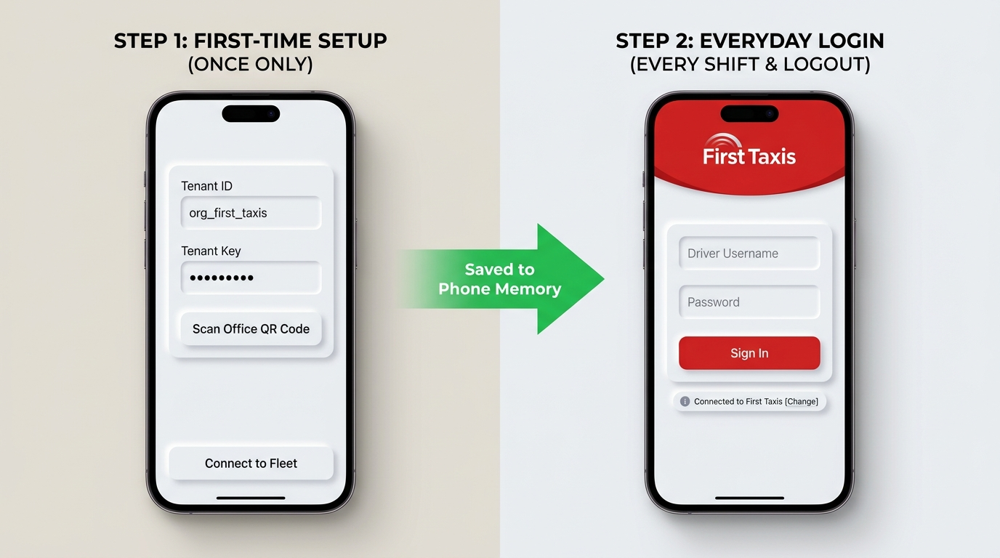
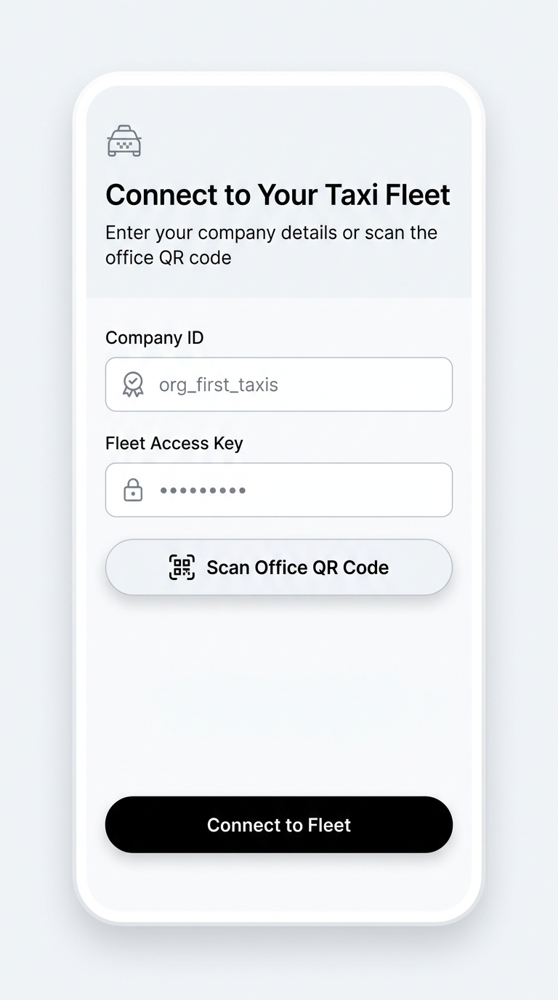
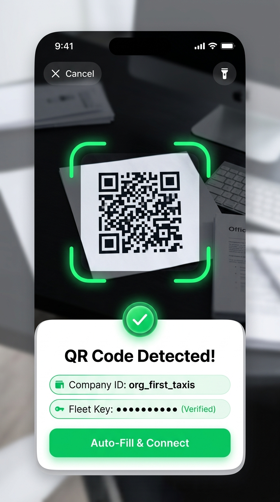
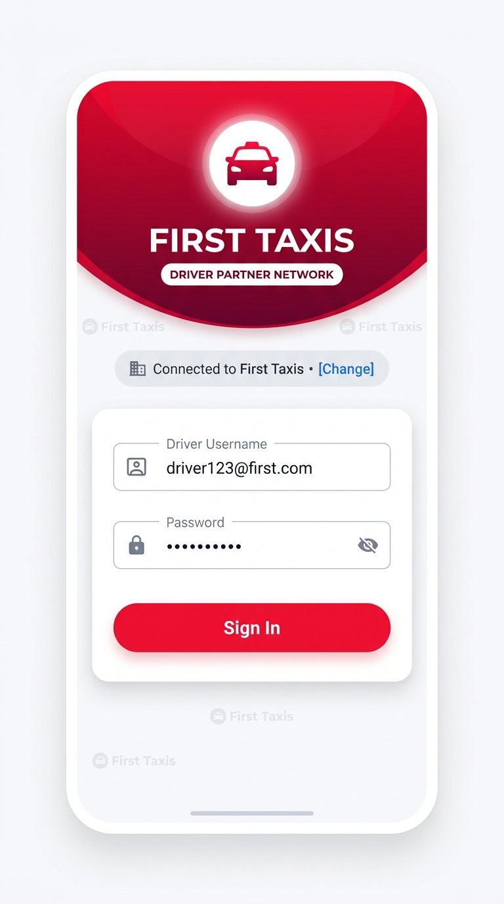
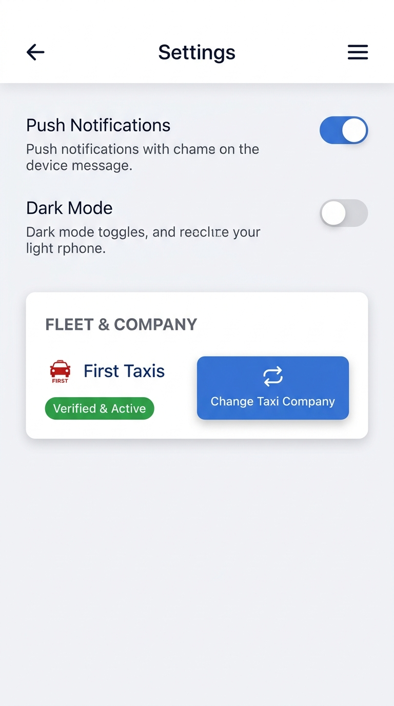

# Driver App: Fleet Setup & Custom Branding Guide
**A Simple, Non-Technical Guide for Fleet Owners, Managers, and Drivers**

---

## 🌟 What is This New Feature?

Imagine having **one single mobile app** that can automatically transform into **any taxi company's official app**!

Whether your drivers work for **First Taxis**, **Ace Taxis**, or **Red Taxis**, they don't need different apps downloaded from the app store. 

As soon as a driver connects to your company:
* 🎨 The app's **colors** change to match your brand (e.g. vibrant red, sleek blue, emerald green, or gold).
* 🏷️ The app's **logo** switches to your company's official logo.
* 🏢 The app's **name and title** change to your company name.
* 📋 Job receipts, menus, and booking screens all show your company details.

Best of all: **Drivers only set this up once!**

---

## 📱 How It Works: Visual Side-by-Side Comparison

Here is the exact difference between **First-Time Setup** and **Everyday Login**:

  

### The 4 Key Fields Explained Simply

| Field Name | When Do You Enter It? | What Is It For? |
| :--- | :--- | :--- |
| **1. Tenant ID / Company ID** | **Once only** (First launch) | Identifies your taxi company (e.g. `org_first_taxis`). Tells the app which company's logo & server to connect to. |
| **2. Tenant Key / Fleet Key** | **Once only** (First launch) | Secret security key from your office. Ensures only authorized drivers from your fleet can connect. |
| **3. Driver Username / ID** | **Everyday shift & logout** | Your personal driver username, badge number, or email. |
| **4. Password** | **Everyday shift & logout** | Your private account password. |

---

## 🚀 The 3 Easy Steps

### Step 1: First-Time Setup (Done Only Once)
When a driver installs and opens the app for the very first time, the app asks: *"Which taxi fleet do you drive for?"*

  

    
    
1. Tap "Scan Office QR Code"

  

  

    
    
2. Camera Scans & Auto-Fills Details!

  

1. **Option A (Manual Entry)**: The driver enters their **Company ID** (e.g. `org_first_taxis`) and **Fleet Key** given to them by their office manager.
2. **Option B (Fastest! 1-Tap QR Scan)**: The driver taps **"Scan Office QR Code"** and points their phone camera at the onboarding sheet. The app instantly recognizes the fleet, shows a green checkmark, and **auto-fills all fields automatically**!
3. The driver taps **Connect to Fleet** (or **Auto-Fill & Connect**).
4. **That's it!** The app locks into their company, saves the configuration safely into the phone's secure storage, and transforms the entire screen with the company's official logo and colors.

---

### Step 2: Everyday Work (Clean & Simple)
Once the company is set up, the driver **never has to type the Company ID or Key again**.

Every day when they start their shift—or whenever they log out—the screen looks clean and simple, asking only for their driver credentials:

  

* **No clutter:** Just Username and Password.
* **Branded:** The driver always knows they are logging into the right company with their company's badge and color theme.
* **Even if they log out:** When they sign out at the end of the day, it stays branded and only asks for their username and password next time.

---

### Step 3: Changing Companies (From Settings)
What if a driver moves to a different taxi fleet, or the office updates their fleet key? They don't need to delete and reinstall the app.

They can change it directly inside the app:

  

1. Open **Settings** from the menu.
2. Scroll to **Fleet & Company**.
3. Tap **Change Taxi Company**.
4. Enter the new Company ID and Key (or scan the new QR code).
5. The app automatically re-dresses itself in the new company's colors and logo!

*(There is also a small **"[Change]"** button directly on the login screen if the driver ever needs to switch before logging in).*

---

## 🎁 Why This Is Great For Everyone

### 1. For Fleet Owners & Taxi Companies
* **Your Own Branded App:** Your drivers see your logo, your colors, and your company name every time they work.
* **Fast Onboarding:** Hand a new driver a printed sheet with a QR code. They scan it, and their app is instantly configured.
* **No Extra App Store Headaches:** You don't need to publish and maintain 10 different apps on Google Play or Apple App Store. One app serves every fleet!

### 2. For Drivers
* **Super Easy to Use:** No need to remember complex company codes every day.
* **Fast Login:** Open the app, type your password (or use saved password), and hit "Sign In".
* **Flexible:** If you drive for multiple fleets or change companies, switching takes just 5 seconds.

### 3. For Support Staff & Dispatchers
* **Fewer Driver Mistakes:** Drivers can't accidentally log into the wrong company's server because their company is verified and locked in.
* **Instant Brand Updates:** If your company updates its logo or brand colors, the backend updates it automatically. Drivers see the new logo the next time they open the app—no manual app update required!

---

## ❓ Frequently Asked Questions (FAQ)

#### Q: Does the driver have to enter the Company ID and Key every time they log in?
**A:** No! They only enter it **once** when they first install the app. After that, it is saved securely on the phone. Everyday logins only require their Username and Password.

#### Q: What happens when the driver logs out?
**A:** When a driver logs out, the app stays locked to their company. The screen still shows their company's logo and colors, and only asks for their Username and Password to log back in.

#### Q: What if a driver types the wrong Company ID by mistake?
**A:** On the login screen, there is a small link that says **"[Change]"** next to the company name. Tapping it lets them re-enter the correct Company ID and Key immediately.

#### Q: What is a "Fleet Key"?
**A:** Think of a Fleet Key like a digital company keycard. It makes sure that only authorized drivers from your taxi firm can access your fleet's system.

#### Q: Can our office give drivers a QR code instead of typing?
**A:** Yes! The office can generate a simple onboarding QR code. The driver taps "Scan QR Code", points their camera at it, and the Company ID and Key fill in automatically.

---

## 📝 Summary Cheat-Sheet

| Action | What the Driver Sees / Does |
| :--- | :--- |
| **Day 1 (First Install)** | Enters Company ID & Fleet Key (or scans QR code). App transforms into company colors & logo. |
| **Daily Shift** | Only enters **Username** & **Password**. Company logo & colors are already there. |
| **Logging Out** | Returns to the clean screen with **Username & Password only**. Company branding remains. |
| **Switching Companies** | Goes to **Settings ➔ Fleet & Company ➔ Change Taxi Company** (or taps **[Change]** on login screen). |
